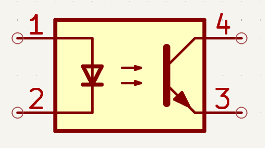
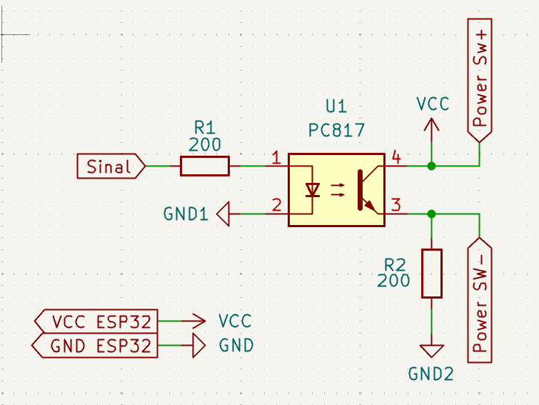

# Funcionamento do circuito
Este é um projeto de dispositivo para ligar computadores de mesa a distância via internet. Este dispositivo é ligado diretamente na placa mãe, e funciona por intermédio de um ESP32-WIFI.

Para garantir a segurança da placa-mãe e, consequentemente, do computador, o dispositivo utiliza o CI PC817, um octacoplador. 
Este circuito integrado é responsável por isolar eletricamente as duas partes do circuito: a conectada a placa-mãe, e a conectada ao ESP32. 
Um octacoplador realiza a comunicação entre duas regiões isoladas de um circuito através de sinais infravermelho. 
Como observado na Figura 1, um sinal percorre o diodo infravermelho emissor (entre os pinos 1 e 2), este emite um sinal infravermelho para o receptor (entre os pinos 3 e 4). Dessa forma, um sinal é emitido sem a necessidade de conexão física entre as partes.
Assim, problemas elétricos na parte do ESP32 não afetam a parte da placa-mãe, e vice-versa.

<div align="center"> Figura 1 </div>

<p align="center">
  
</p>
<div align="center"> Fonte: Editor de esquemas do KiCad </div>

Na Figura 2, é demonstrada uma imagem do esquema do circuito. As entradas Power SW+ e Power SW- representam os dois pinos do cabo responsável por ligar o botão liga/desliga do computador a placa mãe. Neste esquema, elas são ligadas em paralelo a saída do PC817, permitindo o botão liga/desliga funcionar independentemente. O resistor R1, de 200 ohms, limita a corrente que chega ao LED infravermelho interno do octacoplador. Sem ele, o LED pode sofrer sobrecarga e apresentar defeito. O resistor R2, de mesmo valor, faz parte de um circuito pull-dowm, responsável por manter o nível lógico baixo na segunda parte do circuito. A entrada "Sinal" é uma porta digital do ESP32 a escolha do usuário. Neste projeto, é a porta 14 (como visto em [Código do ESP32](liga_desliga_pc_generico.cpp)).

<div align="center"> Figura 2 </div>

<p align="center">
  
</p>
<div align="center"> Fonte: Autoria própria </div>

# Blynk

Para não limitar este iot apenas ao funcionamento em uma só rede, serão utilizados os servidores da Blynk para intermediar a comunicação entre celular e o ESP32. Em primeiro lugar (pelo celular ou computador), crie uma conta no Blynk. Após isso, crie um novo modelo/template. Dentro dele, adicione um novo dispositivo, nomeando ele a sua preferência. Após concluir a criação, o Blynk irá disponibilizar um token de autenticação; será com ele que o ESP32 fará a comunicação. 

Pelo aplicativo do celular, dentro do template, crie um novo widget do tipo "botão". Configure o modo como "pressione" (um toque realiza 1 acionamento no ESP32) e crie um novo Datastream. Com ele, será possível criar um pino virtual. Configure este pino como "integer"; o número do pino é da sua escolha também, mas preferencialmente, escolha "V0". Enfim, a configuração do Blynk está finalizada; o template demonstra quando o ESP32 está online. Depois de terminar a programação do ESP32, o app da Blynk que irá servir para ligar o computador a distância.

# Programação do ESP32 e teste

*OBSERVAÇÃO: garanta que a comunicação entre computador e ESP32 está ocorrendo corretamente. Também confira se o Arduino IDE está devidamente configurado para manipular a placa. Instale o core para ESP32 e a biblioteca Blynk, de Volodymyr Shymanskyy*

Ligue sua placa ESP32 com WI-FI ao computador via cabo, e inicie o Arduino IDE. Copie e cole [Código do ESP32](liga_desliga_pc_generico.cpp)) na IDE, substituindo as áreas sinalizadas com suas informações (nome do wifi, senha, token de autenticação...).

```
#define BLYNK_TEMPLATE_ID   "ID do template"
#define BLYNK_TEMPLATE_NAME "Nome do template"
#define BLYNK_AUTH_TOKEN    "token para conectar ao template no Blynk"
#include <WiFi.h>
#include <BlynkSimpleEsp32.h>

char ssid[] = "Nome da rede wifi", senha[] = "senha da rede";
const int PINO = 14; //pino utilizado no ESP32

BLYNK_WRITE(V0) { digitalWrite(PINO, param.asInt()); }

void setup() {
  pinMode(PINO, OUTPUT);
  Blynk.begin(BLYNK_AUTH_TOKEN, ssid, senha);
}

void loop() { Blynk.run(); }
```

Após isso, verifique e carregue o código no ESP32. Fique atento se o modo de download do ESP32 está ativo; isso pode gerar erros de carregamento. Após a devida configuração, conecte a placa a qualquer fonte de alimentação para testar. Se estiver tudo ok, o dispositivo aparecerá como "Online" no template do Blynk. A Figura 3 demonstra um circuito de teste; se tudo estiver ok, ao acionar o botão no app, o LED irá piscar na protoboard.

# Montagem do circuito na placa mãe do computador
